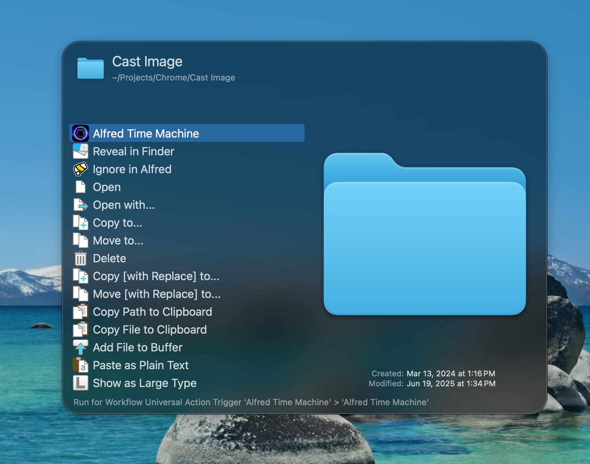
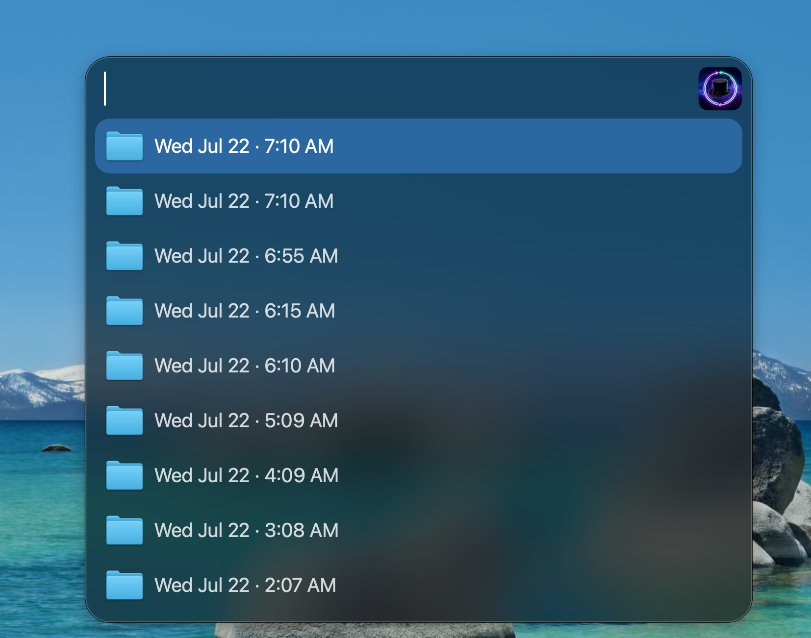

# Alfred Time Machine 

Instant file & app restoration from Time Machine backups, right from Alfred. No slow UI, no spinning stars.

<div align="center">
  
  &nbsp;&nbsp;&nbsp;&nbsp;
  
</div>

## How it Works

**Alfred Time Machine** is a high-speed restoration tool for macOS:

1.  **`alfred-tm` binary** — A compiled Swift CLI that instantly scans your Time Machine backups (both external drives and local APFS snapshots) to find historical versions.
2.  **Alfred Workflow** — A clean, fast picker UI for your Universal Actions.

## Installation

### Option 1: Download from Releases (Recommended)

1. Download the latest [`AlfredTimeMachine.alfredworkflow`](https://github.com/saihgupr/AlfredTimeMachine/releases/download/v1.1.0/AlfredTimeMachine.alfredworkflow) from [Releases](https://github.com/saihgupr/AlfredTimeMachine/releases/latest).
2. Double-click `AlfredTimeMachine.alfredworkflow` to import it into Alfred.
3. **Full Disk Access**: Time Machine requires **Full Disk Access**. Go to `System Settings > Privacy & Security > Full Disk Access` and ensure **Alfred** is enabled.

### Option 2: Build from Source

```bash
git clone https://github.com/saihgupr/AlfredTimeMachine.git
cd AlfredTimeMachine
bash deploy.sh
```

> [!IMPORTANT]
> **Alfred Powerpack required.** Universal Actions require Alfred's Powerpack license.

## Usage

### Via Universal Actions (Recommended)

1.  In **Finder**, click any file or application to select it.
2.  Press your **Alfred Universal Actions hotkey** (default: `⌥→`).
3.  Search for **"Alfred Time Machine"**.
4.  Browse the versions found:
    - **External Drive** — Backups from your Time Machine disk.
    - **Local Snapshot** — Recent backups stored on your internal drive (last ~24h).
5.  Press **↩ Enter** to restore.

### Keyboard Shortcuts

| Key | Action |
| :--- | :--- |
| `↩ Enter` | Restore as `(Restored)` next to the original |
| `⌘↩ Enter` | Restore a copy to your Home folder instead |

---

## Advanced

### CLI Usage

You can use the binary directly from your terminal:

```bash
# List all versions
./alfred-tm list "/path/to/file"

# Restore a specific version
./alfred-tm restore "/source/backup/path" "/original/path"
```

### Automatic "Damaged" App Fix
Alfred Time Machine automatically handles Gatekeeper issues when restoring `.app` bundles. It clears quarantine flags, strips restrictive Time Machine ACLs, and performs ad-hoc signing so restored apps open immediately.

## Building from Source

If you modify the Swift source, rebuild the workflow with:

```bash
bash build_workflow.sh
```

Requirements: macOS 12+, Xcode Command Line Tools, Alfred 5 with Powerpack.
